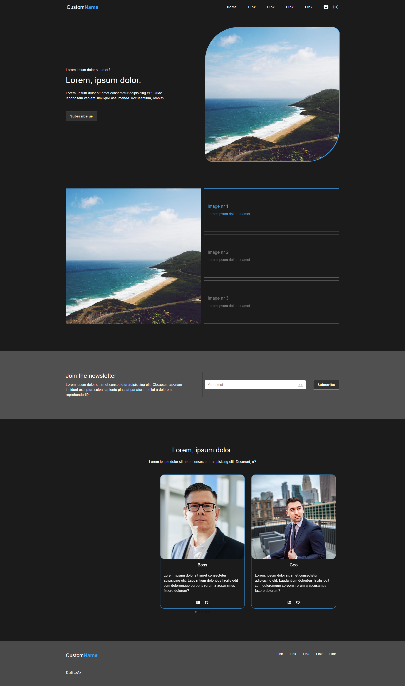

# CustomName



## Welcome! 👋

Thank you for looking here :)

I present my next project of a sample website based on Bootstrap library (working locally on a computer) using HTML, SCSS, JS . I also used [Parcel](https://en.parceljs.org/getting_started.html) code bundler for the project and [SwiperJS](https://swiperjs.com/) frot the slider on page.

You can open the project directly from the 
> dist/index.html.

If you want to see all the code content before build and open on localhost, then follow these steps:

```
npm i

npm run dev
```

